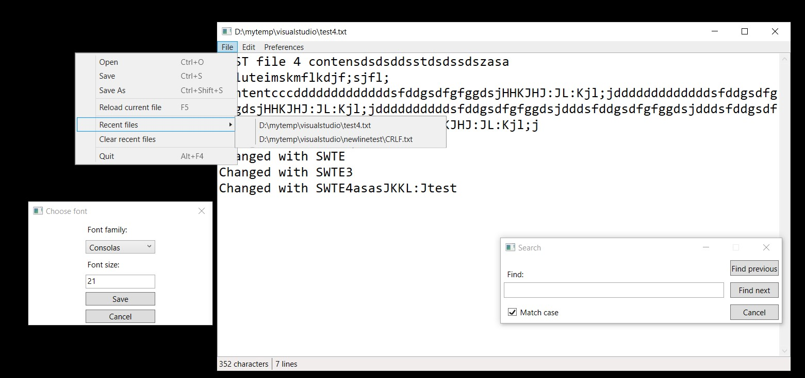

# Simple WPF Text Editor

Simple text editor written in WPF. Basically a notepad clone.

Features:
- Open/Save/SaveAs files
- Use any font installed in the system.
- Search for occurrences of specified text in an opened file (Ctrl+F).
- Hotkeys for the majority of functions.
- Recent files.
- Reload the current file with F5.
- Counter of characters and lines in the current file.
- Support for multiple languages. Currently English and Russian.

Screenshot:

